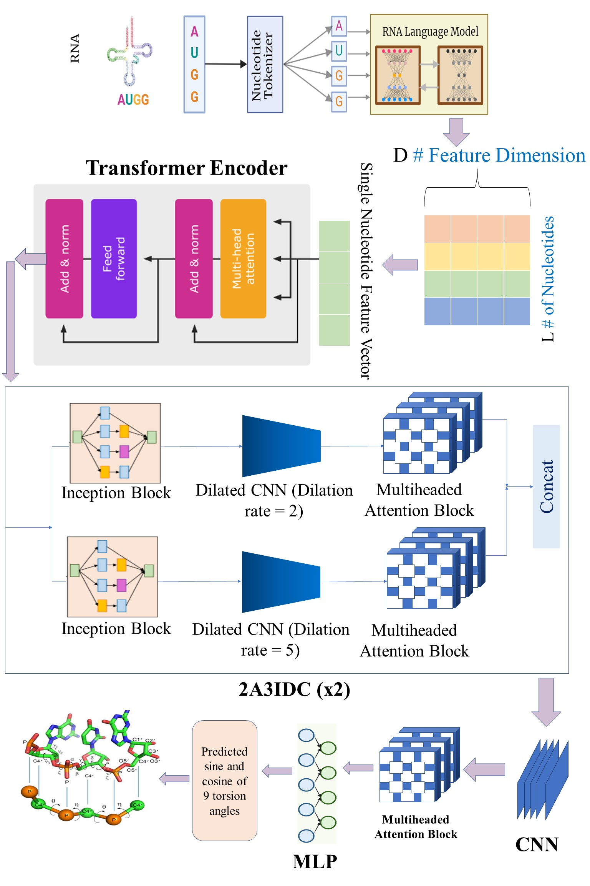

## DeepRNA-Twist: RNA Torsion Angle Prediction
We introduce DeepRNA-Twist, a novel deep learning framework designed to predict RNA torsion and pseudo-torsion angles directly from sequence. DeepRNA-Twist utilizes RNA language model embeddings, which provides rich, context-aware feature representations of RNA sequences. Additionally, it introduces 2A3IDC module, combining inception networks with dilated convolutions and multi-head attention mechanism. The dilated convolutions capture long-range dependencies in the sequence without requiring a large number of parameters, while the multi-head attention mechanism enhances the model’s ability to focus on both local and global structural features simultaneously.
### Installation

1. **Clone the repository**:
   ```bash
   git clone https://github.com/abrarrahmanabir/DeepRNA-Twist.git
   cd DeepRNA-Twist


2. **Install dependencies**:

   ```bash
   pip install numpy tensorflow torch scikit-learn pandas transformers keras tqdm


### How to Train
1. **Train the Model**:
To start the training process, execute the following command:

   ```bash
   python main.py

## How to Run Inference

### Requirements:
- Pre-trained model: `Model/trained_DeepRNAtwist.h5`
- Input dataset: `Data/combined_full.csv`
- Language model embeddings must be loaded as part of the inference process.

### Steps to Run Inference:

1. **Prepare the Input Data**:
   Ensure that the input file `Data/combined_full.csv` is available in the repository's `Data/` folder. This CSV file contains the RNA sequence and angles for which you want to predict torsion angles.

2. **Load the Pre-trained Model**:
   The pre-trained model `Model/trained_DeepRNAtwist.h5` is included in the repository. The inference script will load this model automatically to perform predictions.

3. **Load Language Model Embeddings**:
   For the inference process, the necessary language model embeddings have to be loaded for prediction.

4. **Run the Inference**:
   To perform inference on the provided dataset, run the following command:
   
   ```bash
   python inference.py 


### Model Architecture



